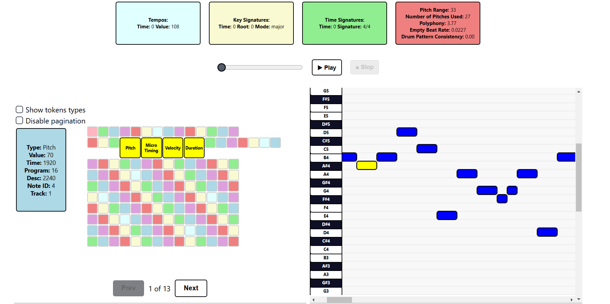

## Added functionalities:

- Miditok library upgrade: from 2.1.7 to 3.0.4
- Added PerTok tokenizator
- New logics of corresponding notes with tokens (forced by library upgrade)
- New parameters in configuration (mostly for PetTok): use_programs, use_microtiming, ticks_per_quarter, max_microtiming_shift, num_microtiming_bins
- Default tokenizator classes, now associating notes to tokens is run after we receive tokens, unifed functions for all tokenizers depending on "use_programs" parameter usage 

### frontend:

- New design in general
- Subtle animations
- New piano roll- high resoultion, stable keybord so it does not vanish with scrolling
- Tokens can be paginated and scaled
- New audio player



## Deployment

You can see an example deployment on Railway [here](https://miditok-visualizer-production-frontend.up.railway.app/)
As long as we're above our trial limit on Railway 

## Running locally:

You can use same commands as before to run the project locally.

### Frontend

Basic run:

```sh
cd frontend
npm install
npm run dev
```

Using Docker:

```sh
cd frontend
docker build . -t frontend
docker run frontend -p 3000:3000
```

### Backend

Basic run:

```sh
cd backend
poetry shell
poetry install
python -m core.main
```

or

```sh
poetry run python -m core.main
```

Using Docker:

```sh
cd backend
DOCKER_BUILDKIT=1 docker build --target=runtime . -t backend
docker run backend -p 8000:8000
```

### All at once:

```sh
docker-compose up
```

## Contributors

- Karol Bogumił
- Maksymilian Banach
- Jakub Przesmycki